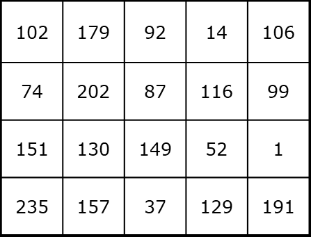
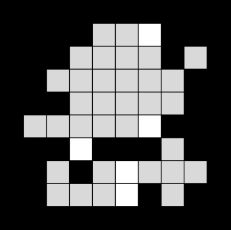

# 📘 レポート課題２ — 画像処理・画像処理工学

**配布日**: *January, 2026*

**提出期限**: **2026年1月26日 (月) 23:59**

---

## 目次
- [📘 レポート課題２ — 画像処理・画像処理工学](#-レポート課題２--画像処理画像処理工学)
  - [目次](#目次)
  - [概要](#概要)
  - [問題1](#問題1)
    - [図A-1: 4×5画素グレースケール画像](#図a-1-45画素グレースケール画像)
    - [図A-2: ラベリング前の2値画像](#図a-2-ラベリング前の2値画像)
    - [表A-1: 画素値と出現確率](#表a-1-画素値と出現確率)
  - [問題2](#問題2)
    - [図A-3（参照）](#図a-3参照)
    - [図A-4（参照）](#図a-4参照)
  - [提出方法・注意事項](#提出方法注意事項)
  - [採点基準（抜粋）](#採点基準抜粋)
  - [ファイル・画像の場所](#ファイル画像の場所)

---

## 概要
このファイルは配布資料（`R7_kadai-report2_20260109.pdf`）の精密な文字起こしおよびMarkdown化版です。本文の欠落がないように注意して抽出・整形してあります。図は自動抽出して `work2/extracted/images/` に保存されています。

> 画像を別名にリネームしたり図番号を付け替えて整理することも可能です（希望があれば対応します）。

---

## 問題1
> レポートには答えだけでなく計算・導出過程を必ず記載してください。

1. 図A-1に示す4×5画素の256階調グレースケール画像にメディアンカット量子化法を適用し，4色の代表色表示を行ってください．

2. 図A-2に示す10×10画素の2値画像に対して，左上から右下にかけて2回の走査処理を行い，各図形成分のラベリングを行ってください．処理の過程として，1回目の走査終了時点のラベリングの様子と，同じ連結成分であると記録したラベル番号の組を示してください．

3. 表A-1のように8つの画素値と出現確率が与えられている場合，ハフマン木を作成してハフマン符号化を行い，平均符号長を求め，等長符号の場合と比較してください．

### 図A-1: 4×5画素グレースケール画像

**キャプション**: 4×5ピクセル，256階調のサンプル画像

> 画像ファイル: `work2/extracted/images/page_001_img_1.png`

### 図A-2: ラベリング前の2値画像

**キャプション**: 10×10ピクセルの2値画像（ラベリング演習用）

> 画像ファイル: `work2/extracted/images/page_001_img_2.png`

### 表A-1: 画素値と出現確率

| 画素値 | 出現確率 [%] |
|:------:|-------------:|
| 0 | 30 |
| 1 | 2 |
| 2 | 6 |
| 3 | 4 |
| 4 | 1 |
| 5 | 5 |
| 6 | 20 |
| 7 | 32 |

---

## 問題2
> レポートには「理論（変換式等）」「プログラムリスト」「結果」「考察」を記載してください。

1. 図A-3（2値画像: `a2-3_binary_image.png`）を読み込み，膨張・収縮などのモルフォロジー処理でノイズを除去してください．選んだ処理手順とその理由（例: 開閉処理で小さな孤立ノイズを除去）を明示してください．

2. 図A-4（カラー画像: `a2-4_color_image.png`）に対して，JPEG品質を0〜100まで10刻みで変化させ，品質（主観評価／SSIMなど）とデータ圧縮率（基準: 元PNG）との関係を調査し，推奨する品質を述べてください．

3. 任意のグレースケール画像に2次元FFTを適用し，振幅スペクトルを可視化してください．対数スケールを用い，低周波が中心に来るようシフト（中心化）してください．画像は512×512や1024×1024等の正方形にトリミングして扱ってください．

4. 3)で選択した画像に対して2種類以上の周波数フィルタ（例: ローパス／ハイパス，理想／ガウシアン／バターワース）を適用し，各フィルタの周波数応答の形（画像）とフィルタ後の結果を示し，考察してください．

**考察の例：**
- ローパスフィルタやハイパスフィルタのサイズを変えて実行結果の画像を比較する
- 授業で示した形以外のフィルタを自作して試してみる

### 図A-3（参照）
- 参照画像名: `a2-3_binary_image.png`

### 図A-4（参照）
- 参照画像名: `a2-4_color_image.png`

---

## 提出方法・注意事項
- レポート本体: `組番号_氏名_rep2.pdf`（例: `499_原貴之_rep2.pdf`）
- Colabノートブック: `組番号_氏名_book2.ipynb`（例: `499_原貴之_book2.ipynb`）
- 問題2-3/2-4で用いた画像ファイル一式（名前はプログラムと一致させること）

必須項目:
- 表紙（科目・題目・クラス・番号・氏名・提出日）を付けること．
- 問題1は計算・導出過程を明記すること．手書き解答は写真で掲載可（判読可能な品質にする）．
- Colabノートブックは上から順に実行できる状態にすること．
- 生成AIを利用した場合は結果と検証を自分で確認し，文章は自分の言葉で記載すること（AI臭のする強調や過度の箇条書きは減点対象）．

---

## 採点基準（抜粋）
- 問題1: 30点（各10点×3問）
- 問題2: 50点（2-1:10点, 2-2:10点, 2-3:10点, 2-4:20点）
- Colabノートブックの実行可否: 20点

---

## ファイル・画像の場所
- 抽出元PDF: `work2/R7_kadai-report2_20260109.pdf`
- 抽出結果Markdown（自動）: `work2/extracted/R7_kadai-report2_20260109.md`
- 精密版（本ファイル）: `work2/R7_kadai-report2_precise.md`
- 抽出画像フォルダ: `work2/extracted/images/`

---

> **備考**: 本ファイルは元PDFの全文を含むように作成しています（図・表・注意事項・提出要件を含む）。画像名の変更や図番号の自動付与、図キャプションの追加など、さらに整えることが可能です。希望があれば指示ください。
