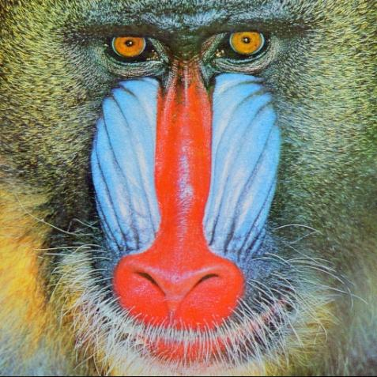

# R7_kadai-report2_20260109.pdf

## Page 1

January, 2026
画像処理・画像処理工学 レポート課題２

○ 次の課題を行い，レポートを作成してください．

問題1（レポートには答えだけではなく計算・導出過程を記載してください）
1) 図A-1 に示す4×5 画素の256 階調グレースケール画像について，メディアンカット量
子化法を適用し，4 色の代表色表示を行ってください．
2) 図A-2 に示す10×10 画素の2 値画像に対して，左上から右下にかけて2 回の走査処理
を行って，各図形成分のラベリングを行ってください．処理の過程として，1 回目の走
査終了時点のラベリングの様子と，同じ連結成分であると記録したラベル番号の組を示
してください．
3) 8 つの画素値とその出現確率が表A-1 のように表されるとき，ハフマン木を作成してハ
フマン符号化を行ってください．また，平均符号長を求め，等長符号の場合と比較して
ください．

図A-1 4×5 画素グレースケール画像

図A-2 ラベリング前の2 値画像

### 表A-1: 画素値と出現確率一覧

| 画素値 | 出現確率 [%] |
|:------:|-------------:|
| 0 | 30 |
| 1 | 2 |
| 2 | 6 |
| 3 | 4 |
| 4 | 1 |
| 5 | 5 |
| 6 | 20 |
| 7 | 32 |

**Figures on page 1:**

## Page 2

January, 2026
問題2（レポートには理論，プログラムリスト，結果および考察を記載してください）
1) 図A-3 の2 値画像（a2-3_binary_image.png）を読み込んで，膨張収縮処理を行い画像
に含まれるノイズを除去してください．レポートにはどのような処理を選択したのか理
由とともに記載してください．
2) 図A-4 のカラー画像（a2-4_color_image.png）に対して，JPEG の圧縮品質を0～100
まで10 ずつ変化させながら，非可逆圧縮を行い，画像の品質とデータ圧縮率の関係を
調査してください．また，上記の調査結果から，JPEG 画像の品質をどの値に設定する
べきか，自分の考えを述べてください．ただし，データの圧縮率を求める際には，元の
PNG 画像のデータサイズを基準とすること．
3) グレースケール画像に2 次元FFT を適用し，振幅スペクトルを画像として可視化して
ください．可視化の際には，高周波の様子が確認しやすいように対数をとり，中心が低
周波成分となるようにシフトを行ってください．画像は各自で用意・選定し，512×512
画素や1024×1024 画素などの正方形画像になるようにトリミングを行ってください．
カラー画像を選定した場合は，グレースケールに変換してから処理を行ってください．
4) 3)で選定したグレースケール画像に対して，2 種類以上の周波数フィルタリングを行っ
てください．レポートには，適用した各周波数フィルタの概形（画像）とフィルタリン
グを実行した結果の画像をそれぞれ示してください．また，各結果について考察を行っ
てください．
考察の例：
ローパスフィルタやハイパスフィルタのサイズを変えて実行結果の画像を比較する
授業で示した形以外のフィルタを自作して試してみる

図A-3 2 値画像

図A-4 カラー画像

**Figures on page 2:**

## Page 3

January, 2026
○ レポートは下記の手順に従って作成し，MS Teams の [020]R07_5E5J_画像処理・画像処
理工学＞課題＞レポート課題２に提出してください．
1) 以下の３つを提出してください．ファイル名は指定したものにしてください．
レポート本体：「組番号（半角）_氏名_rep2.pdf」 例）499_原貴之_rep2.pdf
Colab ノートブック：「組番号（半角）_氏名_book2.ipynb」 例）499_原貴之_book2.ipynb
問題2-3,2-4 に用いた画像（ファイル名は自由だがプログラムに合わせること）
2) レポートには表紙を付け，科目，レポート題目，クラス，番号，氏名，提出日を入れて
ください．
3) 問題1 については答えだけではなく，計算・導出過程も記載してください．手書きで作
成したものを写真としてレポートに掲載しても構いません．その場合は，文章や図，数
式などが判読可能であることを必ず確認してください．
4) 問題2 については理論（変換式等），プログラムリスト，結果および考察を記載してく
ださい．
5) 入力および出力画像を適当な大きさで入れてください．（例えば画像サイズを小さくす
るとともにjpeg などの圧縮画像とする）
6) Colab ノートブックは，上から順にセルを実行していくと動作確認ができるような状態
にして提出してください．
7) 課題を取り組むにあたってWeb サイトを閲覧したり，プログラミングの補助などに生
成AI を活用したりすることは妨げませんが，必ず自分でも内容が正しいか確認してく
ださい．
8) レポートの文章は自分の言葉で記載してください．見慣れない専門用語，箇条書きの多
用，レポートでは使われない強調表示（太字表記，**アスタリスクで用語を囲む**）な
どの生成AI しぐさが散見された場合には，その問題は採点対象外とします．

○ 提出期限

2026 年1 月26 日(月) 23:59

※期日に遅れたレポートは原則として受理しません．

※取り組めた問題だけでもいいので，必ず期日内に提出してください．

○ レポート評価基準
問題1：30 点（各10 点×3 問）
問題2：50 点（2-1：10 点，2-2：10 点，2-3：10 点，2-4：20 点）
Colab ノートブックが正しく動作するか：20 点
※内容や説明に不足があれば程度に応じて減点します．

以上

